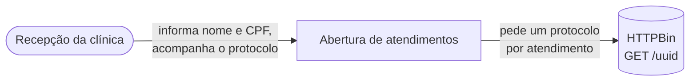
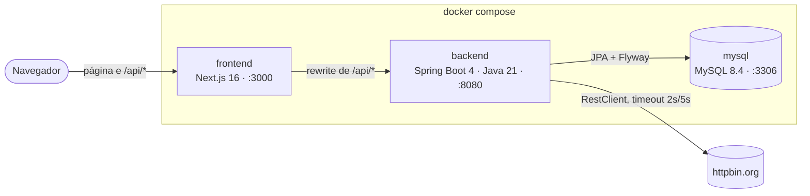
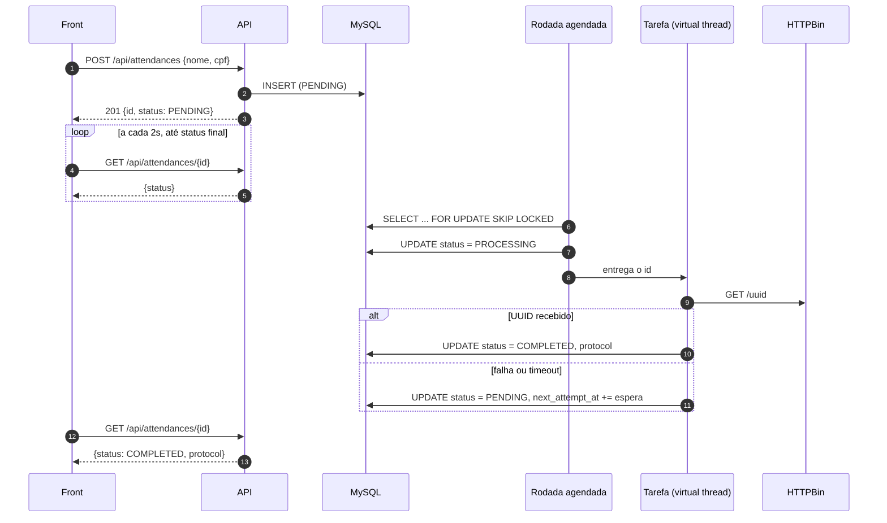
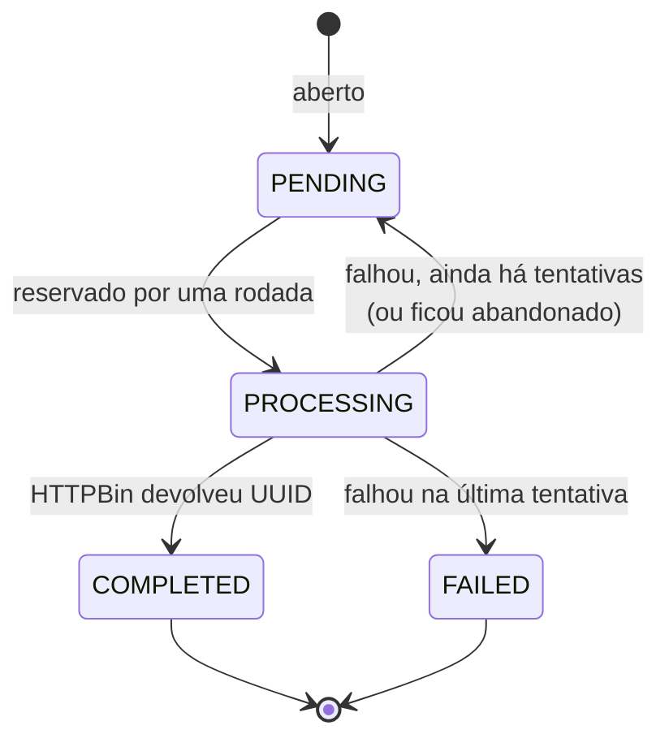

# Arquitetura

## Contexto



## Containers



O navegador só conhece o front. `/api/*` chega ao backend pelo rewrite do Next, na mesma
origem, então não há CORS no caminho normal. O CORS do backend existe para quem roda o front
com `next dev` apontando para outra porta.

## Componentes do backend

```mermaid
flowchart TB
    subgraph web [attendance.web]
        controller[AttendanceController]
    end
    subgraph attendance [attendance]
        service[AttendanceService]
        entity[Attendance<br/>transições de estado]
        repo[AttendanceRepository]
    end
    subgraph processing [processing]
        scheduler[AttendanceProcessingScheduler<br/>@Scheduled]
        dispatcher[AttendanceDispatcher<br/>semáforo + virtual threads]
        pservice[AttendanceProcessingService<br/>transações curtas]
        retry[RetryPolicy]
    end
    subgraph protocol [protocol]
        client[ProtocolClient]
    end

    controller --> service --> repo
    scheduler --> dispatcher --> pservice --> repo
    dispatcher --> client
    pservice --> retry
    service -.-> entity
    pservice -.-> entity
```

Os pacotes são por assunto, não por camada: `attendance` (abertura e consulta),
`processing` (a rotina periódica), `protocol` (o serviço externo) e `cpf` (a regra do CPF,
usada na validação e na máscara).

## O fluxo principal



## Estados do atendimento



`PENDING` e `PROCESSING` são os estados **abertos**: enquanto um atendimento está neles, o CPF
não abre outro ([ADR 0005](adr/0005-um-atendimento-aberto-por-cpf-garantido-pelo-banco.md)).

## Tabela

| Coluna | Origem | Uso |
|---|---|---|
| `id`, `patient_name`, `cpf`, `status`, `protocol`, `created_at`, `updated_at` | `init.sql` do desafio | — |
| `attempts` | V2 | tentativas feitas; no limite, `FAILED` |
| `next_attempt_at` | V2 | quando o atendimento volta a ser elegível |
| `last_error` | V2 | motivo da última falha |
| `version` | V2 | trava otimista entre a gravação do resultado e a recuperação de abandonados |
| `open_cpf` | V2, gerada | CPF enquanto aberto, `NULL` depois; tem índice único |

Horários em UTC. O índice `(status, next_attempt_at)` atende a consulta da rodada.
